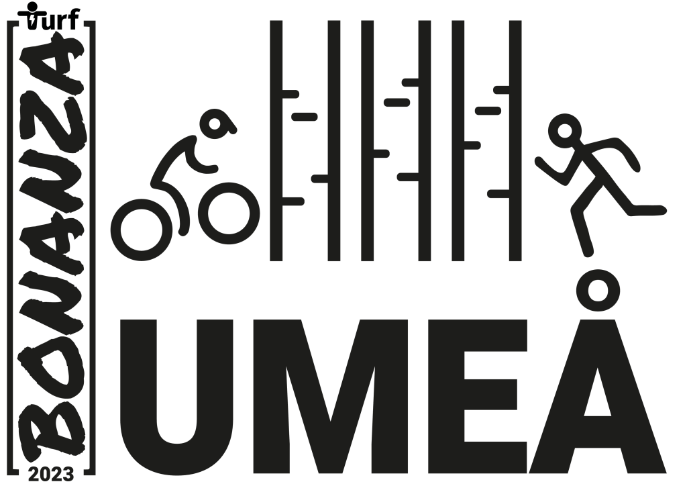
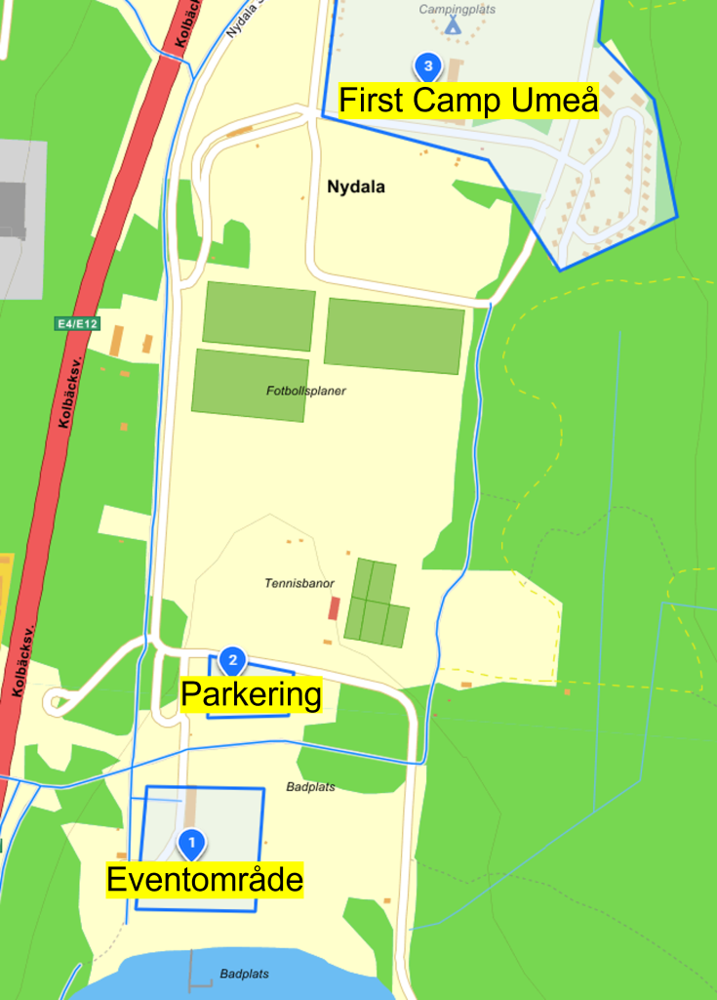

The Turf Västerbotten Association and Turf Crew invite all turfers to

# Turf Bonanza in Umeå 20 May 2023

[Register now!](https://forms.gle/NwnnUrmim8hN3fQo7)

_**This post is continuously updated with the latest information**_

## The northernmost Bonanza

Umeå, the City of Birches, has been given the honor of hosting the 13th edition of Turf Bonanza, which is a perfect fit because Umeå, the Capital of Norrland, is the 13th largest city in Sweden (2021). It will be the northernmost Bonanza to date.

Umeå has plenty of walking and cycling routes and offers over 700 unique turf zones. For those who want to explore more of Västerbotten, there are a further 1,300 zones and Sweden's (toughest?) Turf Classics.

You can read more about Umeå as a destination at [https://visitumea.se/en](https://visitumea.se/sv)

## The two heats

Bonanza 2023 will be conducted in two heats:

1. **Heat 1 - Bonanza Foot  
    **Starts at 10:00 and is a purely walking/running event 

3. **Heat 2 - Bonanza Bike  
    **Starts at 13:00 and is only for cyclists or turfers who use other non-electric vehicles.  
    _Electric bicycles may be permitted for participants with disabilities. Apply for exemption via bonanza@turfvasterbotten.se_

Each heat lasts for 2 hours. The Bonanza Gold, Silver and Bronze medals as well as the Bonanza medal will be awarded in both heats.

The winners of the respective heats also win nice prizes which will be presented here shortly. There will also be a **youth class**, up to 18 years old, where special prizes will be awarded.

The award ceremony takes place at the event area approximately 30 minutes after each heat.

## Event area & parking

The event will have its starting point at Nydalabadet, near the E4 (nearest zone: [UmeBeach](https://turfgame.com/map/umebeach)). Adjacent to the event area (no. 1) is First Camp Umeå (no. 3, [more information can be found under accommodation](#boende)). The area opens at 09.00 and closes approx. at 16:30.

Karta över eventområdet

There is access to changing rooms, toilets and showers. We cover the event area with free WiFi and there are also electrical outlets for charging mobile phones and battery packs. We also offer you to store smaller bags here during the competition.

Free parking spaces for event participants are located approximately 50 meters from the meeting place (no. 2 on the map). Arrive well before your heat starts as the area is popular for outdoor and sporting activities.

**At the event area you will also be able to...**

Check in and collect your goodie bag (if you are one of the first 100 to register).  
Stroll around and meet other turfers.  
Buy some snacks in our own event kiosk GrillZone (the surplus benefits the Bonanza).  
Charge before the start to some good music!  
Follow both heats live on the big screen with webcasts from the competition area and via turfgame.com.  
Meet the Turf Crew and get answers to all conceivable questions about Turf.  
Collect your ordered Bonanza items.  
Buy Turf lottery tickets and participate in various competitions.  
Participate in crowdy record attempts (most turfers taking a zone at the same time).  
See the latest bicycle models and get bicycle service from one of our local bicycle dealers in Umeå - [CM Cykel och Fritid AB](https://www.cmcykel.se/). We are proud that CM Cykel och Fritid sponsors and supports the event by being on site and repairing/ servicing bicycles for a cheap price as well as selling helmets and other bicycle accessories.

In addition to our eminent event kiosk GrillZone, there are grocery stores, a pizzeria and Burger King at Mariehem Centrum (approx. 900 meters from the event area).

## The Bonanza Banquet

At 18:30 we roll out the red turf carpet and welcome everyone to Cinco Restaurante (close to zone [RenastLuft](https://turfgame.com/map/renastluft)).

The banquet costs SEK 400 and includes a nice two-course dinner and the best company! During the evening, there will be the presentation of Turf Awards, pranks, competitions, and a lot of fun - simply an after party you don't want to miss!

[Book your seat at the banquet in the registration form!](https://forms.gle/NwnnUrmim8hN3fQo7)

## Merch/Support Turf Västerbotten

Participating in a Bonanza must of course be free, so we do not charge a registration fee. However, we are dependent on making a little money to be able to host a Bonanza, when [you register](https://forms.gle/NwnnUrmim8hN3fQo7), please take the opportunity to place an order for our exclusive Bonanza t-shirt for only SEK 250 (functional t-shirt) or SEK 200 (cotton t-shirt).

## Register early - pay less!

Ergo, the regular price for the banquet is SEK 400 and for the Bonanza t-shirt SEK 250/200, a total of SEK 650/600 - but if [you registred](https://forms.gle/NwnnUrmim8hN3fQo7) by 2023-02-14 at the latest, you only pay SEK 599/549! This also includes a voucher that you can use in our Bonanza kiosk, GrillZone, and perhaps some more surprises…

## Advice on accommodation

Turf Västerbotten has a partnership with two accommodations that offer discounted prices during the Bonanza weekend. We therefore warmly recommend you to stay at First Camp Umeå (approx. 500 m from the event area, 5.5 km from the banquet) or Hotel Gamla Fängelset (approx. 4.5 km from the event area, 900 m from the banquet).

**Stay in a cell** (click to read more)

The Umeå old prison offers unique and affordable accommodation in a historic building that has been carefully renovated to maintain the prison's original setting. The prison was built in 1861 and is Umeå's oldest stone building that survived the city fire in 1888. Since 2008 it has been converted into a hotel and in connection with Bonazan they have a special offer:

Single room SEK 650 (regular price SEK 725)  
2-bed room: SEK 800 (reg SEK 895)  
Double room: SEK 900 (reg. SEK 995)  
4-bed room: SEK 1,395 (reg. SEK 1,495)  
This includes:  
Accommodation/night with breakfast buffet, bed linen, towel, bathrobe, fresh shared showers & toilets (women's/men's/single), wi-fi, parking.  
Booking code: TURF23  
Booking: Book via info@hotellgf.se, https://www.hotellgf.se/kontakta-oss/  
NB! Provide the booking code at the time of booking to get the discounted price  
(Because we have blocked the entire hotel, it is not possible to make a reservation via our "booking page" with the code on our website before 15 February)

**Stay at a camping** (click to read more)

At First Camp Nydala you get a 20% discount if you state the code _Bonanza2023_ when you make your reservation by phone +4690-70 26 00. The discount applies throughout the week, Monday 15 May to Sunday 21 May. At First Camp offers cabins but there are also caravan/motorhome places.

Don't forget to provide the correct booking code when booking!

## The questions you didn't know you had

Is there a risk of snow?

There is a risk, but it might as well be +20°C.

_Do I need to bring mosquito repellent?_

The mosquito season will probably not have started, but for the sensitive, mosquito repellent can be bought at the nearest pharmacy.

_Does it get dark at night?_

The sun is setting, but it will be bright well into the evening.

_Can I see the northern lights?_

Probably not this time of the year, but [you can read about it here](https://visitumea.se/en/northenlightsguide-umea).

_What do you eat in Västerbotten (or "West Botnia" or "Westrobothnia")_

The locals in [Västerbotten](https://en.wikipedia.org/wiki/V%C3%A4sterbotten) prefer Västerbotten cheese, venison, lingonberries, blueberries, gooseberries…

_Do moose walk around in the city?_

Yes sometimes. But [moose](https://www.wildsweden.com/about/facts-about-moose) thrive best in the forest.

_How do I get to Umeå?_

There are trains from Stockholm, Gothenburg and Norrbotten, flights from Stockholm and ferries from Vaasa, Finland. [Read more about how to travel to Umeå here.](https://visitumea.se/en/travel-to-umea)

<iframe src="https://docs.google.com/forms/d/e/1FAIpQLSfr2Uo2gBgkvHx-laxMeXEmY847TokwtVnfHdcn1WiF4VMBkw/viewform?embedded=true" width="640" height="1651" frameborder="0" marginheight="0" marginwidth="0">Läser in …</iframe>
